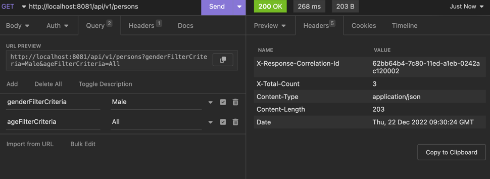
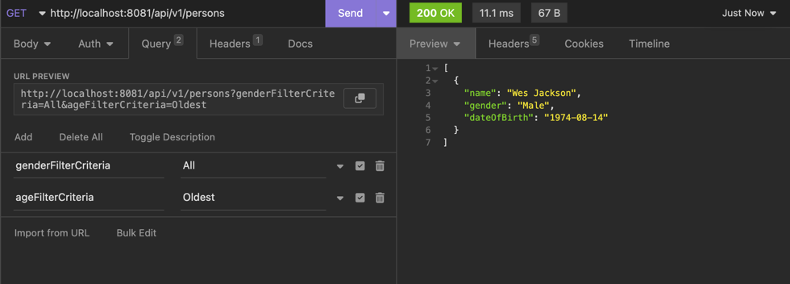
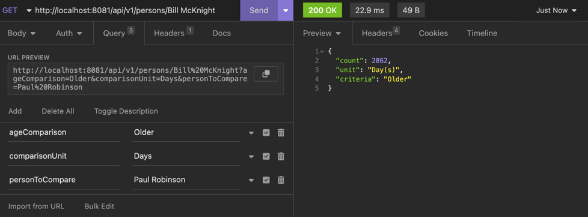

# technical-assignment-be

How many males are in the address book?
X-Total-Count indicates count of the records

Who is the oldest person in the address book?

How many days older is Bill than Paul?

